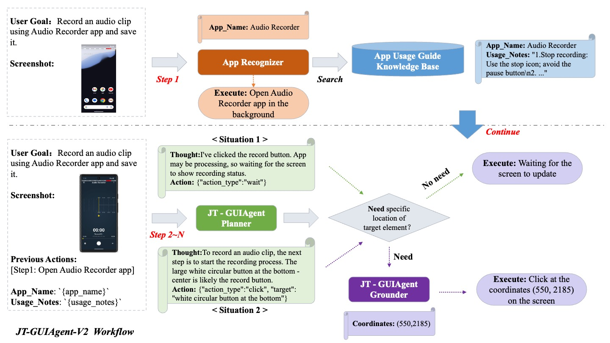
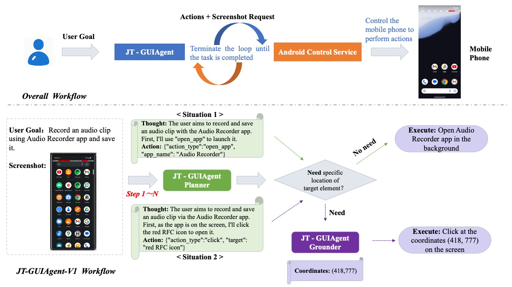

# JT-GUIAgent

## ✨ Overview  

JT-GUIAgent is an advanced GUI Agent family developed by China Mobile's Jiutian, featuring innovative Planner-Grounder frameworks:

### 🚀 V2 Upgrades [2025.07.15]
- **APP-Specific Knowledge Injection** paradigm
- **App Recognizer** for automatic application identification
- **Usage Guide Knowledge Base** with structured Usage_Notes
- Zero-shot adaptation to new applications
- **67%** end-to-end success rate in [AndroidWorld](https://github.com/google-research/android_world)  

### 🎯 V1 Highlights [2025.06.17]
- Two-phase collaborative framework (**Planner + Grounder**)
- Systematic task execution for complex workflows
- Modular design for flexible adaptation
- Independent optimization of components
- **60%** end-to-end success rate in [AndroidWorld](https://github.com/google-research/android_world)  

## ✨ Architecture  

### V2 Enhanced Architecture

### V1 Framework

## ✨ About JT-GUIAgent-V2
**JT-GUIAgent-V2** extends the Planner-Grounder framework of V1 by introducing APP-Specific Knowledge Injection, a novel paradigm to address inaccurate planning in complex GUI scenarios. While V1 decouples task execution into global planning (Planner) and local action grounding (Grounder), V2 significantly enhances robustness in mobile environments by dynamically **integrating APP-contextual knowledge into the Planner**.

The key innovations include:
1. **App Recognizer**: Automatically identifies target applications from user task descriptions.
2. **App Usage Guide Knowledge Base**: Retrieves structured Usage_Notes (e.g., special operation paths, icon semantics, or domain-specific constraints) for the identified APP.
3. **Knowledge-Augmented Planner Prompting**: Dynamically integrates Usage_Notes into planning context for precise step-by-step reasoning.

These notes are injected into the Planner’s prompt context, enabling:

- ✅ **Precise Planning**: Aligns with APP-specific workflows to avoid redundant/cyclic steps. 
- ✅ **Error Mitigation**: Resolves model "blind spots" (e.g., uncommon icons or hidden gestures) through external knowledge. 
- ✅**Zero-Shot Adaptation**: Supports rapid deployment to new APPs without retraining.

Notably, V2 retains V1’s well-designed Planner-Grounder workflow and models, ensuring minimal architectural changes and stable low-level action execution. 

## ✨ About JT-GUIAgent-V1

### Planner: High-Level Task Orchestration
Features a structured prompt template with:
- Intelligent action space selection
- Multi-step task decomposition
- Execution guidelines
- Chain-of-thought reasoning

### Grounder: Precise Element Localization
Utilizes an enhanced training strategy with:
- Open-source UI datasets + synthetic Chinese app data
- Benchmark performance (ScreenSpot-V2):
**Performance Metrics:**

| Component | Accuracy |
|-----------|----------|
| Text | 97.2% |
| Icon | 82.5% |

## ✨ Technical Implementation

**Core code (jt_guiagent_v2)**

- `gui_agent.py` - Core agent framework  
- `get_app_name.py` - Get app Name

**Core Framework (jt_guiagent_v1)**

- `gui_agent_server.py` - FastAPI service layer
- `gui_agent.py` - Core agent framework  
- `model.py` - Model interface (proprietary)

**Evaluation Suite (androidworld_eval)**

- `agent_jt_v1.py`&`agent_jt_v2.py` - Evaluation script
- `result_info_v1.pdf`&`result_info_v2.pdf` - Task performance report
- `result_level_v1.txt`&`result_level_v2.txt` - Capability metrics

## ✨ Case Studies  

### AndroidWorld Benchmark Tasks

| Difficulty | User Instruction | Demo Link                                             |
|------------|-------------|-------------------------------------------------------|
| Easy       | Record an audio clip using Audio Recorder app and save it. | [▶️ View Demo](./video/AudioRecorderRecordAudio.mp4)  |
| Medium     | Send a text message using Simple SMS Messenger to +15132327939 with message: The night is dark and full of terrors. | [▶️ View Demo](./video/SimpleSmsSend.mp4)             |
| Hard       | In Simple Calendar Pro, create a calendar event on 2023-10-17 at 3h with the title 'Catch up on Annual Report' and the description 'We will prepare for software updates. Looking forward to productive discussions.'. The event should last for 60 mins. | [▶️ View Demo](./video/SimpleCalendarAddOneEvent.mp4) |

### Real-World Chinese Applications

| Scenario | User Instruction | Demo Link                                     |
|----------|------------------|-----------------------------------------------|
| Video Playback | 打开b站，播放《孤独的美食家第10季》的第2集。 | [▶️ View Demo](./video/CNAPP_PlayVideo.mp4)   |
| Ticket Ordering | 打开12306，购买5月20日北京出发到西安、最早一班的车票，其他要求：二等座、靠窗。 | [▶️ View Demo](./video/CNAPP_TicketOrder.mp4) |

## ✨ Future Directions:

1. **Natural Interaction** - Develop intuitive user-agent dialogues with risk-aware operation handoff and clarification protocols.
2. **Faster Execution** - Optimize single-round reasoning and streamlined action flows for rapid response.
3. **Precision Enhancement** - Boost accuracy via app-specific model tuning and auto-reflective error detection.
4. **Self-Improvement** - Enable autonomous knowledge base optimization through execution feedback loops.